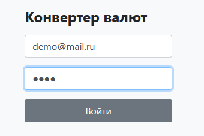
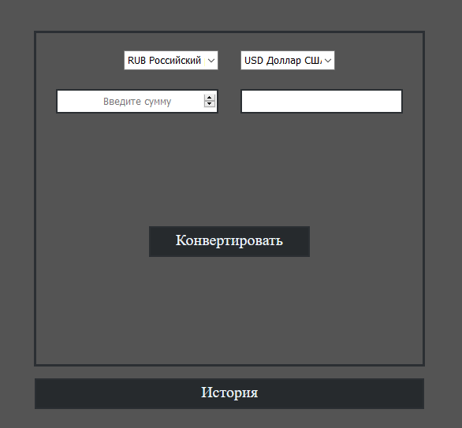

##Описание работы конвертера
#####Сначало необходимо выполнить вход (тестовый email и пароль для входа demo@mail.ru demo)

#####После удачного входа, происходит запрос в цбрф для получения данных о курсах валюты на текущую дату 
(http://www.cbr.ru/scripts/XML_daily.asp) 
более подробную информацию можно найти тут https://cbr.ru/development/sxml/.

Вся полученная информация обновляется в бд

Затем пользователю предоставляется возможность конвертировать валюту

При нажатии на кнопку конвертировать при помощи js отправляется запрос 
на сервер, где он и обрабатывается, возвращается результат конвертации, а так же
сохраняется история конвертации:

- **Исходная валюта**
- **Целевая валюта**
- **Исходная сумма**
- **Получаемая сумма**
- **Курс на момент конвертации**
- **Дата**

При нажатии кнопки история, идет переход на другую страницу, где отображается вся история конвертаций
данного пользователя.